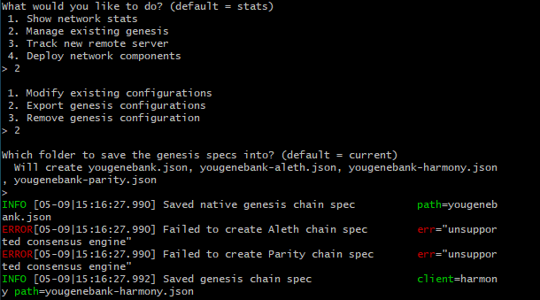

# YouGene Bank Documentation

Yougene Bank is a blockchain ledger that tracks genetic property rights based on a Proof of Authority algorithnm.  The ledger manages and records all transactions for licensing, purchasing, and accessing proprietary genetic data. This solution can be enabled by smart contracts on the ethereum blockchian. The YouGene blockchain gives control over valuable clinical grade data to the curators who create and make available the data and to the clincians and labs that need access the genetic data for use in their laboratory pipelines.

The solution benefits all users because it encourages data curators and data owners to make their data available to others with increased control and reduced risk. Network effects would accrue and the ledger can help clinicals reach the best outcomes based on the best available and trusted clinical-grade.

Tokens inherently have no value here, so we will provide pre-configured accounts and nodes for easy setup.

## Starting the network

Follow the instructions below to setup your environment and get 2 nodes started. You will use the existing two addresses provided to you below.  

## Environment setup instructions and dependencies

Navigate to the Blockchain_tools folder and creating two nodes with accounts for mining rewards using the Proof of Authority algorithm.  

### Create two nodes with accounts to use for mining rewards by initializing the nodes using the genesis block configuration.

First, export your genesis configuration into a yougenebank.json file by 

1. Calling the puppeth prompt and then manage existing genesis by typing 2 and hitting enter.

2. Hit 2 and choose Export genesis configuration and continue with default (current) directory by hitting enter again

3. This will export several yournetworkname.json files -- you only need the first one without aleth, parity, or harmony suffixes. 

4. Next, create two nodes to build ther chain from the genesis block reward by creating the first node's data directory using the geth command and a couple of command line flags by running the following line in your terminal window (Git Bash in Windows):

./geth account new --datadir node1

5. You will be asked for a password. Go ahead and create one.  You should see a succcess message similar to this one:

6. Write down the information and save it.

7. Repeat the process for a node 2

./geth account new --datadir node2

### Initialize the nodes

1. Initialize the first node with yougenebank.json as shown below:

./geth init yougenebank.json --datadir node1

2. You should a success message:

3. Repeat the same for a node2.

./geth init yougenebank.json --datadir node2

### Starting and mining the nodes

Time to start your blockchain network by opening a terminal window (Git Bash in Windows) and navigate to your Blockchain-Tools folder and follow the next steps.

1. Launch the first node into mining mode with the following command:

./geth --datadir node1 --mine --minerthreads 1

2.  The --mine flag tells the node to mine new blocks. The --minerthreads flag tells geth how many CPU threads, or "workers" to use during mining. Since our difficulty is low, we can set it to 1. You should see the node Committing new mining work:

3.  Copy this command into your notes and label it Start Node 1. Now you will launch the second node and configure it to let us talk to the chain via RPC.  Scroll up in the terminal window where node1 is running, and copy the entire enode:// address (including the last @address:port segment) of the first node located in the Started P2P Networking line. We will need this address to tell the second node where to find the first node. Open another terminal window and navigate to the same directory as before and run the command below to new port 30304.

./geth --datadir node2 --port 30304 --rpc --bootnodes "enode://<replace with node1 enode address>" --ipcdisable

## Configuration of the network

You are running two local nodes on a testnet using geth. MyCrypto allows us to explore a wallet, which is just a public key address. 

### Chain ID

Select any unique Chain ID such as 333.

### Account passwords

Never chart your account passwords or private keys. Keep your mnenomic safe and store somewhere secure. Not on your computer. 

### Ports, etc.

We will be using local port http://127.0.0.1:8545 for MyCrypto. Node 1 and Node 2 will be running on 30303 and 30304, respectively. Only node 2 will require --rpc flag.

## How to connect MyCrypto to your network and demonstrate (screenshots and steps) and send a transaction

### Connect MyCrytpo 

Get the private key from the account with which you used to prefund your testchain.  Unlock your wallet using your mnemonic phrase and choose the address you want to inspect. Select the ETH address you use to pre-fund your chain, and in the "Select" dropdown list, choose "Wallet Info. Click on the eye icon next to the "Private Key" field, and copy and paste the private key of the wallet.

Then, Click "Add Custom Node", then add the custom network information that you set in the genesis. Make sure that you scroll down to choose Custom in the "Network" column to reveal more options like Chain ID:

Looks like we're filthy rich! This is the balance that was pre-funded for this account in the genesis configuration; however, these millions of ETH tokens are just for testing purposes.

Now we're going to send a transaction to ourselves to test it out. Follow the next steps. Copy the pre-fund address into the "To Address" field, then fill in an arbitrary amount of ETH:

Click the Check TX Status when the green message pops up, confirm the logout:

You should see the transaction go from Pending to Successful in around the same block time you set in the genesis. You can click the Check TX Status button to update the status.

